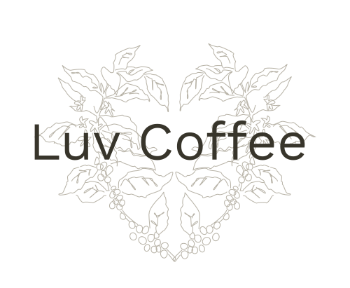

<!-- AUTO-GENERATED-CONTENT:START (STARTER) -->

  

<h1 align="center">
  <a href="https://luvcoffee2020.netlify.app/">Luv Coffee Demo 2020</a>
</h1>

This was a power demo a-z. This means in a short time frame I designed the logo, color pallette, imagery and illustration and developed what you see here.

> If you find an issue (spelling lol) want to suggest an improvement or just some feedback open an [issue on github](https://github.com/LucasZapico/luv-coffee-demo-2020/issues) and tag it accordingly. Cheers Internet!

### What this is?

This was an exercise to go through production with the objective of increase my pace and effectiveness. To go over the workflows;

- Logo creation
- UI design
- UX design
- Illustration Creation
- Imagery Curation and Editing
- Development

### Known areas for improvement

These are the things that didn't make in durning period I lotted for the projects, or features that need some more love.

- enhance the home page bean shopping experience (make if more capturing)
- lazy load main background image
- I would like to make scroll to next section
- I think there is room for some animations to enhance the experience
- A coffee video on repeat would be a nice enhancement
- Adding filter to the shop (this feature would be part of integrating with shopify
- Adding about coffee product page to give the audience more information about the coffee and enhance the experience

## Credits

### Branding

I use the term branding here softly as this project did not require true branding. For example, community position, market differentiation from a business and social perspective.

#### Mark/Logo

Concept and designed by [design.Lucas Zapico](https://design.lucaszapico.space), there was a Pinterest search and some inspiration from my own person collection of Marks.

#### Color Palette

Inspiration for Color Palette;

- [Color and Fonts](https://www.colorsandfonts.com/color-palettes)
- [ColorHunt](http://www.colorhunt.co/)
- [ColorWise](https://colorwise.io/?ref=prototyprio&utm_source=prototypr_newsletter&utm_medium=email&utm_campaign=dangerous_drop_downs_nintendo_labo_and_laws_of_ux&utm_term=2018-01-22)

#### Typography

 <a href="https://fonts.google.com/" className="db">
                Google Fonts
              </a>
              <a
                href="https://fonts.google.com/specimen/IM+Fell+Double+Pica"
                className="db"
              >
                IM Fell Double Pica - Script Type
              </a>

### Design

#### Photography

Photos found on Unsplash photo credit below;

                Photo by{" "}
                <a href="https://unsplash.com/@nate_dumlao?utm_source=unsplash&amp;utm_medium=referral&amp;utm_content=creditCopyText">
                  Nathan Dumlao
                </a>{" "}
                on{" "}
                <a href="https://unsplash.com/?utm_source=unsplash&amp;utm_medium=referral&amp;utm_content=creditCopyText">
                  Unsplash
                </a>
              
              
                Photo by{" "}
                <a href="https://unsplash.com/@lum3n?utm_source=unsplash&amp;utm_medium=referral&amp;utm_content=creditCopyText">
                  LUM3N
                </a>{" "}
                on{" "}
                <a href="https://unsplash.com/s/photos/nectarine?utm_source=unsplash&amp;utm_medium=referral&amp;utm_content=creditCopyText">
                  Unsplash
                </a>
              
              
                Photo by{" "}
                <a href="https://unsplash.com/@relentlessjpg?utm_source=unsplash&amp;utm_medium=referral&amp;utm_content=creditCopyText">
                  William Moreland
                </a>{" "}
                on{" "}
                <a href="https://unsplash.com/?utm_source=unsplash&amp;utm_medium=referral&amp;utm_content=creditCopyText">
                  Unsplash
                </a>
              

A bit of photo hacking done with RemoveBackground

#### UX

UX was mocked in [Figma](https://figma.com) by [design.Lucas Zapico](https://design.lucaszapico.space). Though the user experience was relatively simple. I recently did a research pass on UX be practice for shopping experience and the main take away and driving force is to make the search and exploration of products navigable. This being said, I know it could be improved, but I am happy with the results from a power pass.

#### UI

UI was designed in [Figma](https://figma.com) by [design.Lucas Zapico](https://design.lucaszapico.space)

#### Illustration

Pencil and paper illustration was designed in [Figma](https://figma.com) by [design.Lucas Zapico](https://design.lucaszapico.space)

### Development

All development was done by [dev.Lucas Zapico](https://dev.lucaszapico.space)

#### Platform

[Gatsbyjs](https://www.gatsbyjs.com/)

#### Icons

[React Icons](https://react-icons.github.io/react-icons/)

#### CSS/SCSS

[Tachyons](http://tachyons.io/)

#### Animations

[React Spring](https://www.react-spring.io/)

#### Depoyment

[Netlify](netlify.com)
